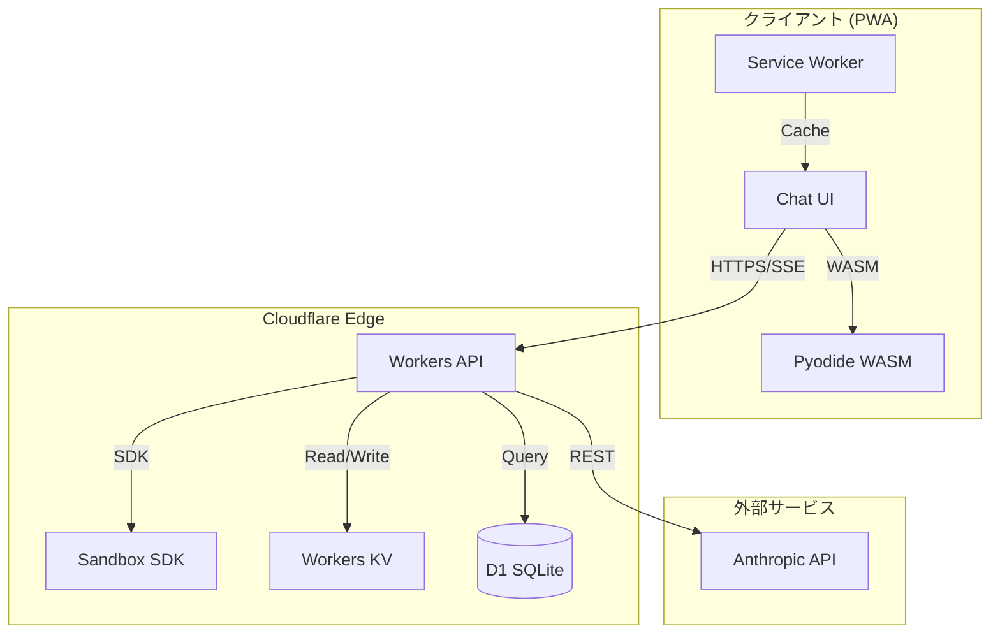
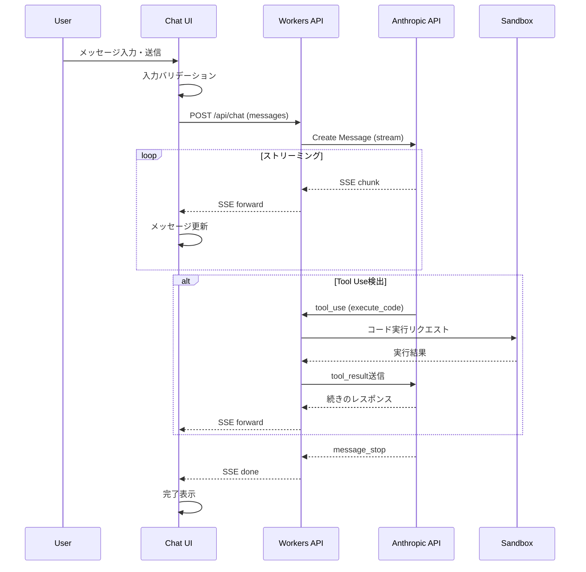
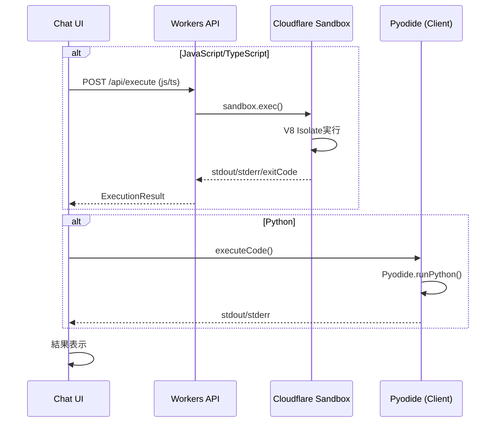
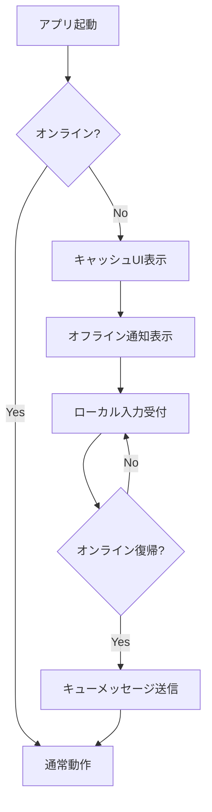
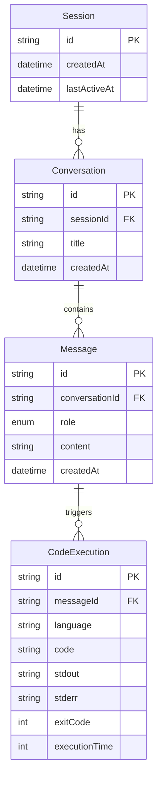

# 設計ドキュメント

## Overview

**Purpose**: Claude Code Webセルフホスト版は、ブラウザ上でClaude AIと対話しながらコードを作成・実行できるPWAアプリケーションを提供します。Cloudflare Sandbox上で安全にコードを実行し、個人開発者やチームが自分のCloudflareアカウントでセルフホストできます。

**Users**: 個人開発者、チーム開発者、モバイルユーザーが、外出先や移動中でもAI支援コーディングを行うために使用します。

**Impact**: 従来のローカル開発環境に依存せず、ブラウザのみでAI対話型コーディングを実現します。

### Goals
- Claude AIとの対話を通じた効率的なコーディング支援
- Cloudflare Sandboxによる安全なコード実行環境の提供
- PWAによるモバイルファーストな体験
- ワンコマンドでのセルフホストデプロイ

### Non-Goals
- 完全なIDE機能（デバッガ、Git統合など）- Phase 2以降
- マルチユーザー認証・認可 - Phase 2以降
- ファイル永続化 - Phase 2以降
- リアルタイムコラボレーション機能

---

## Architecture

### Architecture Pattern & Boundary Map



**Selected Pattern**: Edge-First Monolith
- フロントエンドとバックエンドを単一リポジトリで管理
- Cloudflare Workersでバックエンドをエッジデプロイ
- フロントエンドはStatic Assets（Pages/Workers Sites）

**Domain Boundaries**:
- `chat`: AI対話ドメイン（メッセージ、会話管理）
- `sandbox`: コード実行ドメイン（言語、実行結果）
- `storage`: 永続化ドメイン（セッション、履歴）

**Steering Compliance**:
- TypeScript strict mode
- Honoフレームワーク使用
- Cloudflareネイティブストレージ使用

### Technology Stack

| Layer | Choice / Version | Role in Feature | Notes |
|-------|------------------|-----------------|-------|
| Frontend | React 18 + Vite 5 | PWA UI | Zustand状態管理 |
| Backend | Hono 4 + Workers | API Gateway | SSEストリーミング |
| Sandbox | Cloudflare Sandbox SDK | コード実行 | JS/TS実行 |
| Python Runtime | Pyodide 0.26 | Python WASM | クライアントサイド |
| Storage | D1 + KV | 永続化 | 会話履歴、セッション |
| CDN | Cloudflare | 静的配信 | グローバルエッジ |

---

## System Flows

### 1. チャットメッセージ送信フロー



### 2. コード実行フロー



### 3. PWAオフラインフロー



---

## Requirements Traceability

| Requirement | Summary | Components | Interfaces | Flows |
|-------------|---------|------------|------------|-------|
| 1.1-1.6 | チャットUI | ChatContainer, MessageList, InputArea | - | チャット送信フロー |
| 2.1-2.7 | Sandbox実行 | SandboxService, PyodideRunner | POST /api/execute | コード実行フロー |
| 3.1-3.6 | AI連携 | AnthropicService | POST /api/chat (SSE) | チャット送信フロー |
| 4.1-4.6 | PWA | ServiceWorker, Manifest | - | PWAオフラインフロー |
| 5.1-5.6 | Backend API | Hono Routes | REST API | 全フロー |
| 6.1-6.6 | セキュリティ | Middleware, Sandbox | - | 全フロー |
| 7.1-7.5 | パフォーマンス | 全コンポーネント | - | 全フロー |
| 8.1-8.5 | デプロイ | Wrangler Config | - | - |

---

## Components and Interfaces

### コンポーネントサマリー

| Component | Domain | Intent | Req Coverage | Key Dependencies | Contracts |
|-----------|--------|--------|--------------|------------------|-----------|
| ChatContainer | UI | チャット画面全体 | 1.1-1.6 | MessageList, InputArea | State |
| MessageList | UI | メッセージ一覧表示 | 1.1, 1.4 | MessageItem | - |
| MessageItem | UI | 単一メッセージ | 1.1, 1.4 | CodeBlock | - |
| InputArea | UI | 入力フォーム | 1.5, 1.6 | - | - |
| CodeBlock | UI | コードブロック表示 | 1.1 | Shiki | - |
| useChatStore | Store | チャット状態管理 | 1.2, 1.3 | Zustand | State |
| useCodeExecution | Hook | コード実行管理 | 2.1-2.5 | API, Pyodide | - |
| chatRouter | API | チャットAPI | 3.1-3.4 | AnthropicService | API |
| executeRouter | API | 実行API | 2.1-2.6 | SandboxService | API |
| AnthropicService | Service | Claude API連携 | 3.1-3.6 | @anthropic-ai/sdk | Service |
| SandboxService | Service | コード実行 | 2.1-2.7 | @cloudflare/sandbox-sdk | Service |
| PyodideRunner | Client | Python実行 | 2.2 | Pyodide | - |

---

### Frontend Layer

#### ChatContainer

| Field | Detail |
|-------|--------|
| Intent | チャット画面全体のレイアウトと状態管理を担当 |
| Requirements | 1.1, 1.2, 1.3, 1.4, 1.5, 1.6 |

**Responsibilities & Constraints**
- チャットUIの全体レイアウト管理
- メッセージ送信のトリガー
- ローディング・エラー状態の表示

**Dependencies**
- Inbound: App.tsx (P0)
- Outbound: useChatStore (P0), MessageList (P0), InputArea (P0)

**Contracts**: State [x]

##### State Management
```typescript
interface ChatState {
  messages: Message[];
  isLoading: boolean;
  error: string | null;

  // Actions
  sendMessage: (content: string) => Promise<void>;
  clearMessages: () => void;
}
```

---

#### CodeBlock

| Field | Detail |
|-------|--------|
| Intent | コードブロックのシンタックスハイライト表示と実行ボタン提供 |
| Requirements | 1.1, 1.4 |

**Responsibilities & Constraints**
- Shikiによるシンタックスハイライト
- 言語検出と表示
- コピーボタン提供
- 実行ボタン（実行可能言語の場合）

**Dependencies**
- Outbound: Shiki (P0), useCodeExecution (P1)

**Implementation Notes**
- Shikiはビルド時にテーマとグラマーをバンドル
- コピー機能はClipboard API使用

---

#### useCodeExecution

| Field | Detail |
|-------|--------|
| Intent | コード実行のロジックをカプセル化するカスタムフック |
| Requirements | 2.1, 2.2, 2.3, 2.4, 2.5 |

**Responsibilities & Constraints**
- 言語に応じた実行先の振り分け
- タイムアウト管理
- 結果のフォーマット

**Dependencies**
- Outbound: API (P0), PyodideRunner (P1)

**Contracts**: Service [x]

##### Service Interface
```typescript
interface UseCodeExecutionReturn {
  execute: (code: string, language: Language) => Promise<ExecutionResult>;
  isExecuting: boolean;
  result: ExecutionResult | null;
  error: Error | null;
}

interface ExecutionResult {
  stdout: string;
  stderr: string;
  exitCode: number;
  executionTime: number;
}

type Language = 'javascript' | 'typescript' | 'python';
```

---

### Backend Layer

#### chatRouter

| Field | Detail |
|-------|--------|
| Intent | AI対話APIエンドポイントの提供 |
| Requirements | 3.1, 3.2, 3.3, 3.4, 5.1 |

**Responsibilities & Constraints**
- リクエストバリデーション
- Anthropic APIへのプロキシ
- SSEストリーミングの管理
- Tool Use結果の中継

**Dependencies**
- Inbound: Hono Router (P0)
- Outbound: AnthropicService (P0), SandboxService (P1)

**Contracts**: API [x]

##### API Contract

| Method | Endpoint | Request | Response | Errors |
|--------|----------|---------|----------|--------|
| POST | /api/chat | ChatRequest | SSE Stream | 400, 401, 429, 500 |

```typescript
interface ChatRequest {
  messages: Array<{
    role: 'user' | 'assistant';
    content: string;
  }>;
  model?: string; // default: claude-sonnet-4-20250514
}

// SSE Events
type SSEEvent =
  | { event: 'message'; data: { content: string } }
  | { event: 'tool_use'; data: { name: string; input: object } }
  | { event: 'tool_result'; data: { result: object } }
  | { event: 'done'; data: {} }
  | { event: 'error'; data: { message: string } };
```

---

#### executeRouter

| Field | Detail |
|-------|--------|
| Intent | コード実行APIエンドポイントの提供 |
| Requirements | 2.1, 2.3, 2.4, 2.5, 2.6, 5.2 |

**Responsibilities & Constraints**
- コード入力のサニタイズ
- Sandbox SDKへの委譲
- タイムアウト管理
- 結果のフォーマット

**Dependencies**
- Inbound: Hono Router (P0)
- Outbound: SandboxService (P0)

**Contracts**: API [x]

##### API Contract

| Method | Endpoint | Request | Response | Errors |
|--------|----------|---------|----------|--------|
| POST | /api/execute | ExecuteRequest | ExecuteResponse | 400, 408, 500 |

```typescript
interface ExecuteRequest {
  code: string;
  language: 'javascript' | 'typescript';
  timeout?: number; // default: 30000 (ms)
}

interface ExecuteResponse {
  stdout: string;
  stderr: string;
  exitCode: number;
  executionTime: number;
}
```

---

#### AnthropicService

| Field | Detail |
|-------|--------|
| Intent | Anthropic Claude APIとの通信を抽象化 |
| Requirements | 3.1, 3.2, 3.3, 3.4, 3.5, 3.6 |

**Responsibilities & Constraints**
- APIキーの安全な取得（Secrets）
- Tool定義の管理
- ストリーミングレスポンスの処理
- エラーハンドリング

**Dependencies**
- External: @anthropic-ai/sdk (P0)
- External: Cloudflare Secrets (P0)

**Contracts**: Service [x]

##### Service Interface
```typescript
interface AnthropicService {
  createMessage(
    messages: Message[],
    tools: Tool[]
  ): AsyncGenerator<StreamEvent>;
}

const tools: Tool[] = [
  {
    name: 'execute_code',
    description: 'Execute code in a sandboxed environment',
    input_schema: {
      type: 'object',
      properties: {
        language: {
          type: 'string',
          enum: ['javascript', 'typescript', 'python'],
        },
        code: { type: 'string' },
      },
      required: ['language', 'code'],
    },
  },
];
```

---

#### SandboxService

| Field | Detail |
|-------|--------|
| Intent | Cloudflare Sandbox SDKを使用したコード実行 |
| Requirements | 2.1, 2.3, 2.4, 2.5, 2.6, 2.7 |

**Responsibilities & Constraints**
- Sandboxインスタンスの管理
- コード実行とタイムアウト
- stdout/stderrのキャプチャ
- リソース制限の適用

**Dependencies**
- External: @cloudflare/sandbox-sdk (P0)

**Contracts**: Service [x]

##### Service Interface
```typescript
interface SandboxService {
  execute(
    code: string,
    language: 'javascript' | 'typescript',
    options?: ExecutionOptions
  ): Promise<ExecutionResult>;
}

interface ExecutionOptions {
  timeout?: number;    // default: 30000ms
  memoryLimit?: number; // MB
}
```

**Implementation Notes**
```typescript
// Sandbox SDK使用例
const sandbox = await getSandbox(env.SANDBOX);
const result = await sandbox.exec('node', ['-e', code], {
  timeout: 30000,
});
```

---

### Client Sandbox Layer

#### PyodideRunner

| Field | Detail |
|-------|--------|
| Intent | クライアントサイドでのPython実行 |
| Requirements | 2.2 |

**Responsibilities & Constraints**
- Pyodide WASMのロード管理
- Python実行の抽象化
- 標準出力のキャプチャ

**Dependencies**
- External: Pyodide (P0)

**Contracts**: Service [x]

##### Service Interface
```typescript
interface PyodideRunner {
  isReady: boolean;
  load(): Promise<void>;
  run(code: string): Promise<PythonResult>;
}

interface PythonResult {
  stdout: string;
  stderr: string;
  result: any;
}
```

**Implementation Notes**
- 初回ロードは約5MB、キャッシュ後は高速
- バックグラウンドでプリロード推奨
- メインスレッドブロック回避のためWeb Worker検討

---

## Data Models

### Domain Model



### Logical Data Model

**Message Entity**
```typescript
interface Message {
  id: string;           // ULID
  conversationId: string;
  role: 'user' | 'assistant';
  content: string;
  toolUse?: {
    name: string;
    input: object;
    result?: object;
  };
  createdAt: Date;
}
```

### Physical Data Model (D1)

```sql
-- セッション管理はKVで行い、会話履歴のみD1に保存

CREATE TABLE conversations (
  id TEXT PRIMARY KEY,
  session_id TEXT NOT NULL,
  title TEXT,
  created_at TEXT NOT NULL,
  updated_at TEXT NOT NULL
);

CREATE TABLE messages (
  id TEXT PRIMARY KEY,
  conversation_id TEXT NOT NULL,
  role TEXT NOT NULL CHECK (role IN ('user', 'assistant')),
  content TEXT NOT NULL,
  tool_use TEXT, -- JSON
  created_at TEXT NOT NULL,
  FOREIGN KEY (conversation_id) REFERENCES conversations(id)
);

CREATE INDEX idx_messages_conversation ON messages(conversation_id);
CREATE INDEX idx_conversations_session ON conversations(session_id);
```

### KV Data Structure

```typescript
// セッション情報（TTL: 24時間）
// Key: session:{sessionId}
interface SessionKV {
  id: string;
  createdAt: string;
  lastActiveAt: string;
  conversationIds: string[];
}
```

---

## Error Handling

### Error Strategy

| カテゴリ | HTTPコード | 処理 |
|---------|-----------|------|
| バリデーションエラー | 400 | フィールドレベルのエラーメッセージ |
| 認証エラー | 401 | APIキー未設定の案内 |
| レートリミット | 429 | リトライ時間の通知 |
| タイムアウト | 408 | 実行時間超過の通知 |
| サーバーエラー | 500 | 汎用エラーメッセージ |

### Error Categories and Responses

**User Errors (4xx)**
```typescript
interface ValidationError {
  error: 'validation_error';
  message: string;
  details: Array<{
    field: string;
    message: string;
  }>;
}
```

**System Errors (5xx)**
```typescript
interface SystemError {
  error: 'system_error';
  message: string;
  requestId: string; // デバッグ用
}
```

**Sandbox Errors**
```typescript
interface SandboxError {
  error: 'sandbox_error';
  type: 'timeout' | 'memory' | 'syntax' | 'runtime';
  message: string;
  details?: {
    stdout: string;
    stderr: string;
  };
}
```

### Monitoring

- Workers Analytics: リクエスト数、レイテンシ
- エラーログ: `console.error`でCloudflare Logsに出力
- カスタムメトリクス: Sandbox実行時間、言語別使用率

---

## Testing Strategy

### Unit Tests
- `AnthropicService`: API呼び出しモック、ストリーミング処理
- `SandboxService`: 実行結果パース、タイムアウト処理
- `useChatStore`: 状態更新、メッセージ追加
- `useCodeExecution`: 言語振り分け、結果フォーマット

### Integration Tests
- `/api/chat`: 完全なチャットフロー（モックAnthropic）
- `/api/execute`: JS/TSコード実行（ローカルSandbox）
- Tool Use: チャット中のコード実行トリガー

### E2E Tests (Playwright)
- メッセージ送信と表示
- コード実行と結果表示
- PWAインストールフロー

### Performance Tests
- SSEストリーミングレイテンシ
- Sandbox起動時間（コールドスタート）
- Pyodide初期ロード時間

---

## Security Considerations

### Threat Model
1. **Sandbox Escape**: 悪意のあるコードによるホストアクセス
   - 対策: V8 Isolates、ネットワーク隔離

2. **API Key漏洩**: クライアントへのキー露出
   - 対策: サーバーサイドのみでキー使用、Secrets管理

3. **インジェクション攻撃**: 入力を通じたコード注入
   - 対策: 入力サニタイズ、パラメータ化

4. **DoS攻撃**: 過剰なリクエストによるサービス停止
   - 対策: レートリミット、タイムアウト

### Security Controls

| 脅威 | コントロール | 実装 |
|------|------------|------|
| Sandbox Escape | V8 Isolates | Cloudflare Sandbox SDK |
| API Key漏洩 | Secrets管理 | `wrangler secret` |
| XSS | HTMLエスケープ | react-markdown（デフォルト安全） |
| CSRF | SameSite Cookie | Hono CORS設定 |

---

## Performance & Scalability

### Target Metrics

| メトリクス | 目標 | 測定方法 |
|-----------|------|----------|
| 初期ロード | < 3秒 (3G) | Lighthouse |
| TTFB | < 100ms | Workers Analytics |
| コード実行開始 | < 500ms | カスタムメトリクス |
| AIレスポンス開始 | < 1秒 | SSE最初のchunk |

### Optimization Strategies

1. **フロントエンド**
   - Vite code splitting
   - Shikiテーマ/グラマーの事前バンドル
   - Pyodideの遅延ロード

2. **バックエンド**
   - Honoの軽量ルーティング
   - KVによるセッションキャッシュ
   - Sandbox接続プール（可能な場合）

3. **PWA**
   - 静的アセットのService Workerキャッシュ
   - Runtime caching (stale-while-revalidate)

---

## Supporting References

### Tool定義の完全版

```typescript
const CLAUDE_TOOLS = [
  {
    name: 'execute_code',
    description: 'Execute code in a sandboxed environment. Use this to run and test code.',
    input_schema: {
      type: 'object',
      properties: {
        language: {
          type: 'string',
          enum: ['javascript', 'typescript', 'python'],
          description: 'The programming language of the code',
        },
        code: {
          type: 'string',
          description: 'The code to execute',
        },
      },
      required: ['language', 'code'],
    },
  },
] as const;
```

### wrangler.toml設定例

```toml
name = "claude-code-web"
main = "src/index.ts"
compatibility_date = "2024-01-01"

[vars]
ENVIRONMENT = "production"

[[kv_namespaces]]
binding = "SESSIONS"
id = "xxx"

[[d1_databases]]
binding = "DB"
database_name = "claude-code-db"
database_id = "xxx"

[sandbox]
binding = "SANDBOX"
```

### manifest.json設定例

```json
{
  "name": "Claude Code Web",
  "short_name": "ClaudeCode",
  "description": "AI-powered code execution in browser",
  "start_url": "/",
  "display": "standalone",
  "background_color": "#ffffff",
  "theme_color": "#1a1a2e",
  "icons": [
    { "src": "/icons/icon-192.png", "sizes": "192x192", "type": "image/png" },
    { "src": "/icons/icon-512.png", "sizes": "512x512", "type": "image/png" }
  ]
}
```
