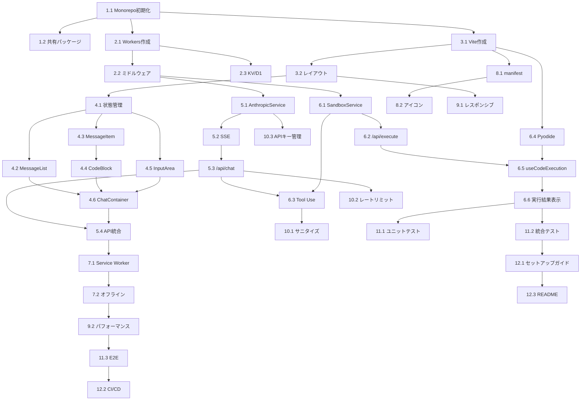

# 実装計画

## Phase 1: 基盤構築

### 1. Monorepoセットアップ
- [ ] 1.1 プロジェクト初期化 (P)
  - pnpm workspaceの設定（pnpm-workspace.yaml）
  - turbo.jsonの設定
  - ルートpackage.jsonの作成
  - TypeScript設定（tsconfig.json）
  - _Requirements: 8.1_

- [ ] 1.2 共有パッケージ作成 (P)
  - packages/shared/の作成
  - 共通型定義（types.ts）
  - 定数定義（constants.ts）
  - パッケージエクスポート設定
  - _Requirements: 8.1_

### 2. バックエンド基盤（Cloudflare Workers）
- [ ] 2.1 Workersプロジェクト作成
  - apps/worker/の作成
  - wrangler.tomlの設定
  - Honoアプリケーション初期化
  - TypeScript設定
  - _Requirements: 5.6, 8.2_

- [ ] 2.2 ミドルウェア実装 (P)
  - CORS設定（middleware/cors.ts）
  - エラーハンドリング（middleware/error.ts）
  - ロギング設定
  - _Requirements: 5.3, 5.4_

- [ ] 2.3 KV/D1セットアップ
  - KVネームスペース作成
  - D1データベース作成
  - マイグレーションスクリプト
  - wrangler.tomlへのバインディング追加
  - _Requirements: 8.3_

### 3. フロントエンド基盤（React + Vite）
- [ ] 3.1 Viteプロジェクト作成 (P)
  - apps/web/の作成
  - React + TypeScript設定
  - Tailwind CSS設定
  - パスエイリアス設定
  - _Requirements: 7.1_

- [ ] 3.2 基本レイアウト実装 (P)
  - Layoutコンポーネント（Header, Sidebar, Main）
  - レスポンシブデザイン基盤
  - ダークモード対応（CSS変数）
  - _Requirements: 4.4_

---

## Phase 2: コア機能実装

### 4. チャットUI実装
- [ ] 4.1 状態管理セットアップ
  - Zustandストア作成（stores/chatStore.ts）
  - Message型定義
  - 状態アクション実装（sendMessage, clearMessages）
  - _Requirements: 1.3_

- [ ] 4.2 MessageListコンポーネント (P)
  - メッセージ一覧表示
  - スクロール管理（自動スクロール）
  - 仮想化検討（長い会話対応）
  - _Requirements: 1.1_

- [ ] 4.3 MessageItemコンポーネント (P)
  - ユーザー/アシスタントメッセージ表示
  - Markdownレンダリング（react-markdown）
  - アバター表示
  - _Requirements: 1.1_

- [ ] 4.4 CodeBlockコンポーネント
  - Shikiによるシンタックスハイライト
  - 言語検出
  - コピーボタン
  - 実行ボタン（実行可能言語）
  - _Requirements: 1.1, 1.4_

- [ ] 4.5 InputAreaコンポーネント
  - テキスト入力フォーム
  - 送信ボタン/Enterキー対応
  - ローディング状態表示
  - 入力バリデーション
  - _Requirements: 1.5, 1.6_

- [ ] 4.6 ChatContainerコンポーネント
  - 全体レイアウト統合
  - 状態接続
  - エラー表示
  - _Requirements: 1.1-1.6_

### 5. AI連携実装
- [ ] 5.1 AnthropicService実装
  - Anthropic SDK初期化
  - createMessage関数
  - Tool定義
  - Secrets取得
  - _Requirements: 3.1, 3.2, 3.5_

- [ ] 5.2 SSEストリーミング実装
  - Server-Sent Events設定
  - ストリームチャンク処理
  - イベント型定義
  - _Requirements: 3.4_

- [ ] 5.3 /api/chatエンドポイント
  - リクエストバリデーション
  - AnthropicService呼び出し
  - SSEレスポンス返却
  - エラーハンドリング
  - _Requirements: 5.1, 3.1-3.4_

- [ ] 5.4 フロントエンドAPI統合
  - useChatフック実装
  - SSE受信処理
  - メッセージ更新
  - エラー処理
  - _Requirements: 1.2, 3.4_

### 6. Sandbox実行実装
- [ ] 6.1 SandboxService実装
  - Cloudflare Sandbox SDK初期化
  - execute関数（JS/TS）
  - タイムアウト管理
  - stdout/stderrキャプチャ
  - _Requirements: 2.1, 2.3, 2.4, 2.6_

- [ ] 6.2 /api/executeエンドポイント
  - リクエストバリデーション
  - コードサニタイズ
  - SandboxService呼び出し
  - 結果フォーマット
  - _Requirements: 5.2, 2.1, 2.5_

- [ ] 6.3 Tool Use統合
  - execute_codeツールハンドリング
  - Sandboxへの委譲
  - 結果のtool_result返却
  - _Requirements: 3.2, 3.3_

- [ ] 6.4 PyodideRunner実装 (P)
  - Pyodide WASMロード
  - Python実行関数
  - stdout/stderrキャプチャ
  - プリロード機能
  - _Requirements: 2.2_

- [ ] 6.5 useCodeExecutionフック
  - 言語振り分けロジック
  - API呼び出し（JS/TS）
  - Pyodide呼び出し（Python）
  - 実行状態管理
  - _Requirements: 2.1, 2.2_

- [ ] 6.6 実行結果表示
  - OutputPanelコンポーネント
  - stdout/stderr表示
  - 実行時間表示
  - エラーフォーマット
  - _Requirements: 1.4, 2.4, 2.5_

---

## Phase 3: PWA対応

### 7. Service Worker実装
- [ ] 7.1 vite-plugin-pwa設定
  - プラグインインストール・設定
  - workbox設定
  - キャッシュ戦略定義
  - _Requirements: 4.1_

- [ ] 7.2 オフライン対応
  - 静的アセットキャッシュ
  - APIレスポンスキャッシュ（一部）
  - オフライン検出
  - _Requirements: 4.3_

### 8. PWAマニフェスト
- [ ] 8.1 manifest.json作成
  - アプリ名、説明
  - テーマカラー設定
  - 表示モード（standalone）
  - _Requirements: 4.2_

- [ ] 8.2 アイコン作成 (P)
  - 192x192, 512x512アイコン
  - マスカブルアイコン
  - ファビコン
  - _Requirements: 4.6_

### 9. モバイル最適化
- [ ] 9.1 レスポンシブUI調整
  - モバイルナビゲーション
  - タッチ操作最適化
  - 仮想キーボード対応
  - _Requirements: 4.4_

- [ ] 9.2 パフォーマンス最適化
  - バンドルサイズ最適化
  - 画像最適化
  - 遅延ロード実装
  - _Requirements: 4.5, 7.1_

---

## Phase 4: セキュリティ・品質

### 10. セキュリティ強化
- [ ] 10.1 入力サニタイズ
  - コード入力のバリデーション
  - XSS対策確認
  - _Requirements: 6.3_

- [ ] 10.2 レートリミット実装
  - /api/chatのレートリミット
  - /api/executeのレートリミット
  - _Requirements: 5.5_

- [ ] 10.3 APIキー管理確認
  - Secrets設定手順文書化
  - 環境変数分離確認
  - _Requirements: 6.4_

### 11. テスト実装
- [ ]* 11.1 ユニットテスト
  - AnthropicService
  - SandboxService
  - useChatStore
  - useCodeExecution
  - _Requirements: 全般_

- [ ]* 11.2 統合テスト
  - /api/chatフロー
  - /api/executeフロー
  - Tool Use統合
  - _Requirements: 全般_

- [ ]* 11.3 E2Eテスト (P)
  - メッセージ送信・表示
  - コード実行・結果表示
  - PWAインストール
  - _Requirements: 全般_

### 12. ドキュメント・デプロイ
- [ ] 12.1 セットアップガイド
  - docs/SETUP.md作成
  - 環境構築手順
  - デプロイ手順
  - _Requirements: 8.1, 8.5_

- [ ] 12.2 CI/CDパイプライン (P)
  - GitHub Actionsワークフロー
  - テスト自動実行
  - 自動デプロイ
  - _Requirements: 8.5_

- [ ] 12.3 README作成
  - プロジェクト概要
  - クイックスタート
  - コスト試算
  - _Requirements: 8.1_

---

## タスク依存関係

---

## 並列実行可能なタスクグループ

### グループA（Phase 1）
- 1.2 共有パッケージ
- 2.1 Workers作成
- 3.1 Vite作成

### グループB（Phase 2初期）
- 2.2 ミドルウェア
- 3.2 レイアウト
- 6.4 Pyodide

### グループC（Phase 2中期）
- 4.2 MessageList
- 4.3 MessageItem
- 4.5 InputArea

### グループD（Phase 3）
- 8.2 アイコン
- 9.1 レスポンシブ
- 12.2 CI/CD

---

## 推定作業規模

| Phase | タスク数 | 推定LOC | 複雑度 |
|-------|---------|---------|--------|
| Phase 1 | 7 | ~500 | 低 |
| Phase 2 | 18 | ~2500 | 高 |
| Phase 3 | 6 | ~400 | 中 |
| Phase 4 | 9 | ~800 | 中 |
| **合計** | **40** | **~4200** | - |
