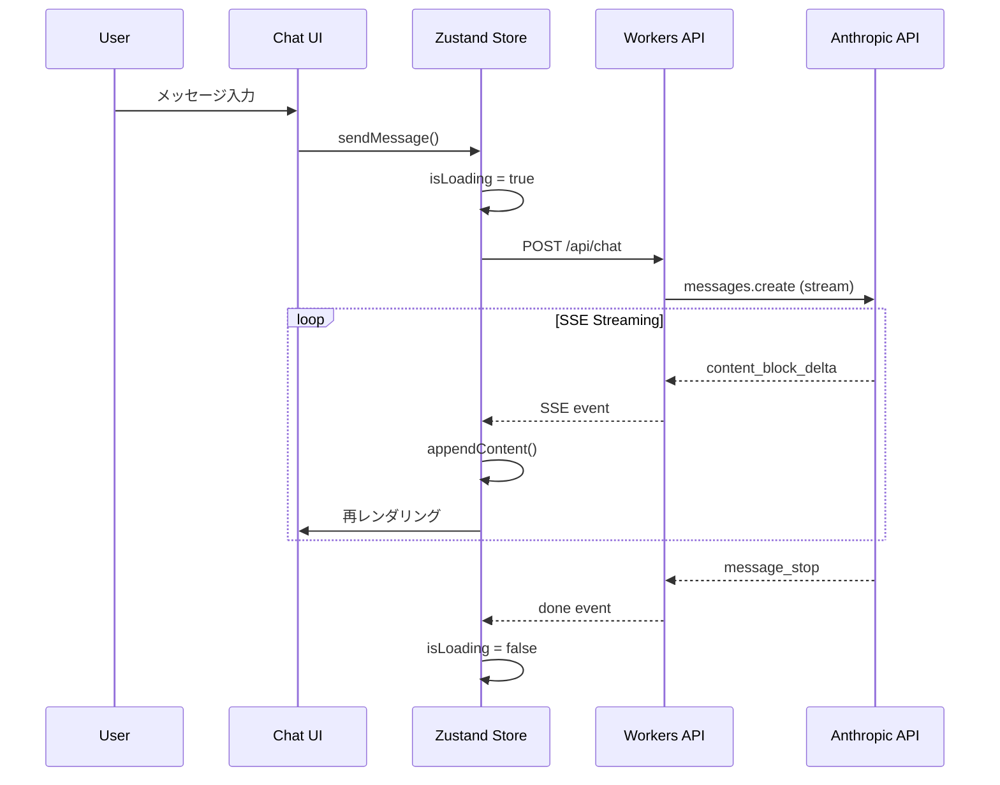
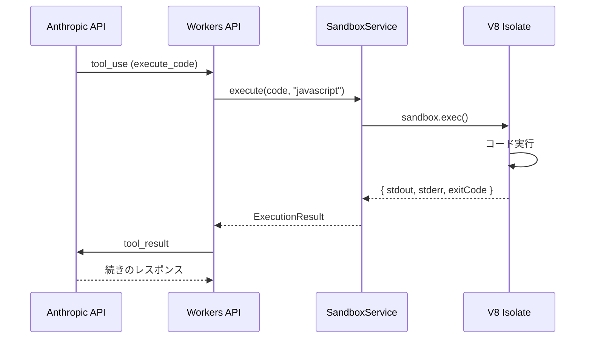
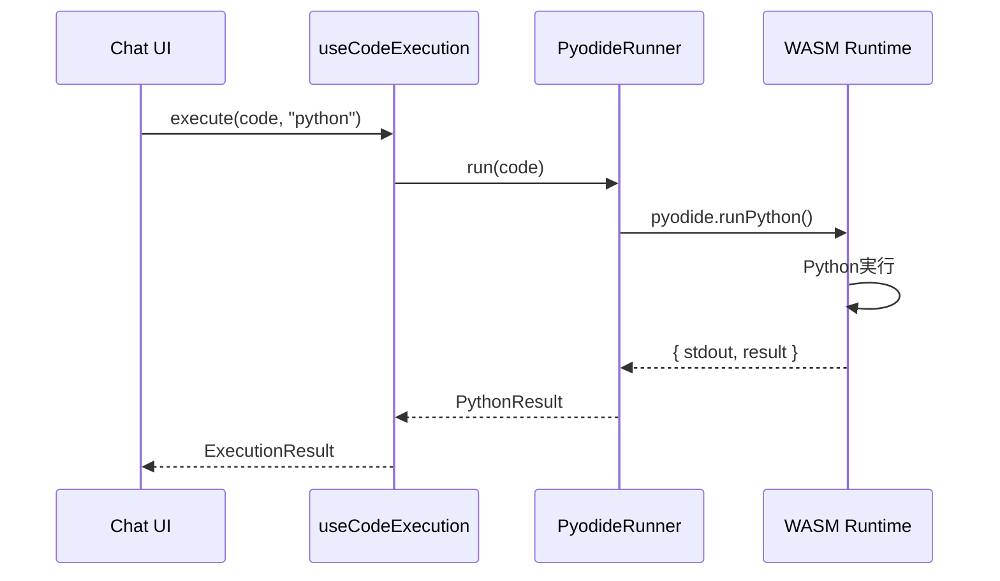

# データフロー

## 概要

このドキュメントでは、Claude Code Webの主要なデータフローを解説します。

---

## 1. チャットメッセージフロー

ユーザーがメッセージを送信し、AIがレスポンスを返すまでのフロー。

```
User Input → Chat UI → Workers API → Anthropic API
                ↑                          ↓
                └──── SSE Streaming ←──────┘
```

### シーケンス詳細



### データ構造

```typescript
// Request
{
  messages: [
    { role: "user", content: "Hello" },
    { role: "assistant", content: "Hi!" }
  ]
}

// SSE Events
{ event: "message", data: { content: "部分的なテキスト" } }
{ event: "done", data: {} }
```

---

## 2. コード実行フロー（JavaScript/TypeScript）

AIがコード実行を要求した場合のフロー。

```
Tool Use → Workers API → Sandbox SDK → V8 Isolate
                ↓                          ↓
          tool_result ←── stdout/stderr ←──┘
```

### シーケンス詳細



### データ構造

```typescript
// Tool Use Input
{
  name: "execute_code",
  input: {
    language: "javascript",
    code: "console.log('Hello')"
  }
}

// Execution Result
{
  stdout: "Hello\n",
  stderr: "",
  exitCode: 0,
  executionTime: 15
}
```

---

## 3. コード実行フロー（Python）

Pythonコードはクライアントサイドで実行されます。

```
Code Block → Pyodide Runner → WASM Runtime
                ↓                   ↓
          UI Update ←── stdout ←───┘
```

### シーケンス詳細



### データ構造

```typescript
// Python Result
{
  stdout: "3.14159...\n",
  stderr: "",
  result: 3.141592653589793
}
```

---

## 4. PWAオフラインフロー

オフライン時のキャッシュ戦略。

```
Request → Service Worker → Cache API
              ↓               ↓
         Network ←─ or ─→ Cached Response
```

### キャッシュ戦略

| リソースタイプ | 戦略 | 理由 |
|--------------|------|------|
| 静的アセット | CacheFirst | 変更頻度低い |
| APIレスポンス | NetworkFirst | 最新データ優先 |
| フォント | CacheFirst | 変更されない |

---

## 5. 状態管理フロー

Zustandによるクライアント状態管理。

```typescript
// Chat Store
interface ChatState {
  messages: Message[];
  isLoading: boolean;
  error: string | null;

  // Actions
  sendMessage: (content: string) => Promise<void>;
  appendContent: (content: string) => void;
  setError: (error: string) => void;
  clearMessages: () => void;
}
```

### 状態更新フロー

```
User Action → Store Action → State Update → UI Re-render
                  ↓
            Side Effects (API calls)
```

---

## 6. エラーフロー

エラー発生時の伝播経路。

```
Error Source → Service Layer → API Layer → Client
                    ↓              ↓          ↓
              Logging      HTTP Status    UI Display
```

### エラーカテゴリ

| ソース | HTTPコード | クライアント表示 |
|-------|-----------|----------------|
| バリデーション | 400 | フィールドエラー |
| 認証 | 401 | APIキー設定案内 |
| レートリミット | 429 | リトライ時間 |
| Sandbox | 408/500 | 実行エラー詳細 |

---

## 関連ドキュメント

- [システムアーキテクチャ](./system-overview.md)
- [API リファレンス](../guides/api-reference.md)
